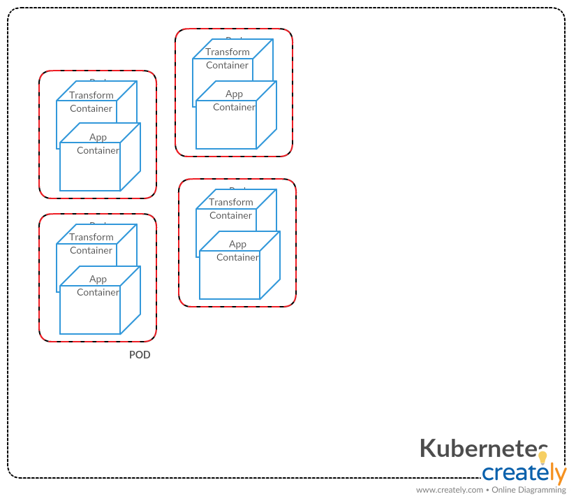

**Description**

  - The application receives a message, and returns the message reversed along with a random number.

  - The application consist of three: 

| microservice      | description                            
| ------------- | -------------------------------------- 
| app   | the main entry point that injects a random number to the response
| transform      | the second microservice that returns a message reversed
| nginx      | the proxy that serves out the application
    
**File Layout**

```
|-- app
|   |-- bin
|   |   |-- run.py
|   |   `-- run.sh
|   |-- Dockerfile
|   `-- requirements.txt
|-- nginx
|   |-- default.conf
|   `-- Dockerfile
|-- transform
|   |-- bin
|   |   |-- run.py
|   |   `-- run.sh
|   |-- Dockerfile
|   `-- requirements.txt
|-- docker-compose.yml
|-- ecs-params.yml
`-- README.md
```

**Build**

  - Each microservice is separated into their own folder with a Dockerfile used for building the image.

  - For example, to build the app microservice and push it to Dockerhub:

```
cd app
docker build -t <docker_username>/app:latest .
docker login -u <username> -p <password>
docker push <docker_username>/app:latest
```

**Deploy**

  - To deploy, you can standup the application on your laptop by using using the docker-compose.yml file.

```
docker-compose up -d
```

  - To deploy to ECS:

Install ECS CLI
```
curl -o /usr/local/bin/ecs-cli https://amazon-ecs-cli.s3.amazonaws.com/ecs-cli-linux-amd64-latest
echo "$(curl -s https://amazon-ecs-cli.s3.amazonaws.com/ecs-cli-linux-amd64-latest.md5) /usr/local/bin/ecs-cli" | md5sum -c -
chmod +x /usr/local/bin/ecs-cli
```

Configure ECS profile and cluster
```
export AWS_ACCESS_KEY_ID=<aws_access_key_id>
export AWS_SECRET_ACCESS_KEY=<aws_secret_access_key>
ecs-cli configure profile --profile-name test --access-key $AWS_ACCESS_KEY_ID --secret-key $AWS_SECRET_ACCESS_KEY
ecs-cli configure --cluster test --region us-east-1 --default-launch-type EC2 --config-name sample
```

Create ECS cluster
```
ecs-cli up --keypair ed_ssh_key --capability-iam --size 1 --instance-type t2.micro --cluster test
```

Standup application as a ECS task
```
ecs-cli compose service up --cluster test --cluster-config sample
```

View cluster processes/status
```
ecs-cli ps --cluster test
```

Increase cluster size
```
ecs-cli scale --capability-iam --size 2 --cluster test
```

Scale service to create redundancy and performance
```
ecs-cli compose service scale 2 --cluster test --cluster-config sample
```

Tear down tasks when done
```
ecs-cli compose service down --cluster test --cluster-config sample
```

Tear down cluster when done
```
ecs-cli down --cluster test
```

**System Diagram (Part 2)** 



ECS is a great way to deploy and scale this application. It provides simplicity without having to manage an underlying cluster system like Kubernetes or Docker Swarm. This is a great option for small startups who have limited DevOps resources. On a side note, the choice is not so much between ECS vs Kubernetes as between AWS vs Kubernetes. For those who require multi-cloud, Kubernetes is the better agnostic choice. For cloud provides such as AWS, GCP, or Azure, simply use their version of Kubernetes as a service and then deploy this app with conventional Kubernetes API/kubectl calls. I have included a cloud agnostic system diagram (system-diagram.png) that shows the two microservices in a pod. The pod is the scaling unit for Kubernetes. Notably, I have removed the nginx proxy since the services layer in Kubernetes handles routing. Furthermore, using Helm charts can also simplify and version your deploys.

**CI/CD (Part 3)**

Continuous delivery (CD) automatically executes unit tests, performs docker builds, and provides automatic deployments.  Users have the option of using a variety of continuous integration (CI) tools such as SaaS products like CircleCI and TravisCI, and more customizable open source options like ConcourceCI and Jenkins.  The SaaS provides will also handle the plumbing (Webhooks/GitOps) like connecting Github/Bitbucket to the CI system. Again, the main criteria is control vs resources; having more control requires more skilled people.  Regardless, any CI system will increase your software velocity, while producing more reliable software. It is truly a win-win situation. To extend CI to CD, it suggested users implement GitOps to control and version deployments through git commits. It is also recommended users practice blue/green canary deploys to safely and progressively cut over to new software without having to schedule downtime.
